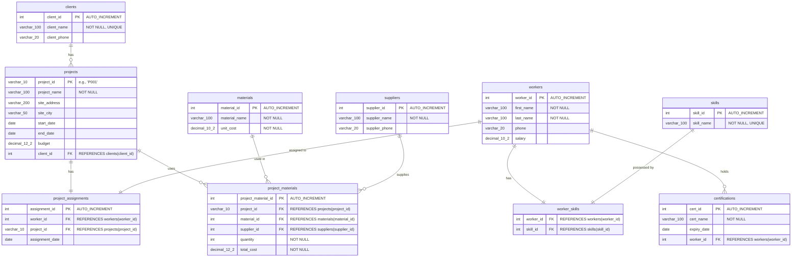

# Big3 Construction Management Dashboard

## Project Overview

A comprehensive construction project management system built with Node.js, Express, MySQL, and Redis. This application provides RESTful APIs for managing projects, workers, clients, materials, and suppliers with advanced features including:

- **JWT Authentication** with role-based access control (RBAC)
- **Geospatial Search** - Find projects near specific coordinates using Haversine distance calculation
- **Internationalization (i18n)** - English and Spanish language support
- **Notification System** - Redis-based message queue for certification expiry alerts
- **Comprehensive Testing** - 80%+ code coverage with Jest

## Tech Stack

- **Backend:** Node.js 18+, Express.js
- **Database:** MySQL 8.0
- **Cache/Queue:** Redis 7.x
- **Authentication:** Passport.js with JWT
- **Validation:** express-validator
- **Testing:** Jest with Supertest
- **Documentation:** JSDoc, Swagger-ready

## Database Schema

The application uses a normalized 5NF database schema for managing construction projects, workers, materials, and client relationships.



## Quick Start

### Prerequisites

- Node.js 18+ and npm
- MySQL 8.0+
- Redis 7.x+
- Git

### Database Setup

Run the migration files in this exact order:

```bash
# 1. Create database and base tables
mysql -u root -p < migrations/01_setup_database.sql

# 2. Insert sample data for Phase 1 tables
mysql -u root -p big3_construction < migrations/02_insert_data.sql

# 3. Add backend-specific tables and columns
mysql -u root -p big3_construction < migrations/07_migrations.sql

# 4. Seed user accounts for authentication
mysql -u root -p big3_construction < migrations/08_seed_users.sql
```

**What each migration does:**
- **01_setup_database.sql** - Creates the `big3_construction` database and all Phase 1 tables (projects, workers, clients, materials, suppliers, etc.)
- **02_insert_data.sql** - Populates tables with sample data for development and testing
- **07_migrations.sql** - Adds backend-specific tables (`users`, `user_activity_log`) and columns (latitude/longitude for projects)
- **08_seed_users.sql** - Creates 5 test user accounts (1 Admin, 2 PMs, 2 Site Supervisors) with bcrypt-hashed passwords

#### Using MySQL Workbench (Alternative)
You can also run these migrations via MySQL Workbench:
- Open Workbench → File → Open SQL Script → select each migration file in order (01 → 02 → 07 → 08)
- Click the lightning bolt (Execute) for each script
- For detailed screenshots and verification queries, see [`SETUP_INSTRUCTIONS.md`](SETUP_INSTRUCTIONS.md)

### Backend Setup

1. **Navigate to backend directory:**
   ```bash
   cd backend
   ```

2. **Install dependencies:**
   ```bash
   npm install
   ```

3. **Configure environment:**
   ```bash
   cp .env.example .env
   # Edit .env with your database credentials
   ```

4. **Start Redis:**
   ```bash
   redis-server
   ```

5. **Run the API:**
   ```bash
   npm start
   # Server runs on http://localhost:5001
   ```

6. **Optional - Run notification consumer:**
   ```bash
   npm run consumer
   ```

**Full Documentation:** See [backend/README.md](backend/README.md) for complete API documentation, testing instructions, and advanced configuration.

## Key Features

### Authentication & Authorization
- **JWT-based authentication** with 7-day token expiration
- **Role-Based Access Control (RBAC)** with three roles:
  - **Admin** - Full system access
  - **PM (Project Manager)** - Manage assigned projects
  - **Site Supervisor** - Read-only access to assigned projects
- Password hashing with bcrypt (10 rounds)

### Geospatial Features
- Find projects within a specified radius of coordinates
- Haversine formula for accurate distance calculation
- RBAC-filtered results (users only see their assigned projects)
- Example: `GET /api/projects/nearme?lat=5.6037&lng=-0.1870&radius=50`

### Internationalization (i18n)
- Multi-language support via `Accept-Language` header
- Supported languages: English (en), Spanish (es)
- All error messages and responses translated
- Example: `Accept-Language: es` returns errors in Spanish

### Notification System
- **Producer/Consumer pattern** with Redis queue
- Automated certification expiry monitoring
- Scalable async processing
- Separate consumer process for handling notifications

### Testing
- **Unit tests** for controllers, services, and utilities
- **Integration tests** for API endpoints
- 80%+ code coverage
- Mock helpers for consistent testing
- Run tests: `npm test`

## Project Structure

```
big3-advanced-sql-formative-1-group-3/
├── backend/                    # Node.js Express API
│   ├── src/
│   │   ├── config/            # Database, Redis, Passport config
│   │   ├── controllers/       # Request handlers
│   │   ├── services/          # Business logic
│   │   ├── repositories/      # Database queries
│   │   ├── middleware/        # Auth, RBAC, i18n, error handling
│   │   ├── routes/            # API route definitions
│   │   ├── jobs/              # Queue producers/consumers
│   │   ├── locales/           # i18n translations (en, es)
│   │   └── utils/             # Helper functions (Haversine, etc.)
│   ├── tests/                 # Unit & integration tests
│   ├── docs/                  # API documentation
│   └── package.json
├── migrations/                 # Database migration scripts
│   ├── 01_setup_database.sql
│   ├── 02_insert_data.sql
│   ├── 07_migrations.sql
│   └── 08_seed_users.sql
└── README.md
```

## API Documentation

### Base URL
```
http://localhost:5001/api
```

### Main Endpoints

**Authentication**
- `POST /api/auth/register` - Register new user
- `POST /api/auth/login` - User login (returns JWT)
- `GET /api/auth/me` - Get current user info

**Projects**
- `GET /api/projects` - List all projects (filtered by role)
- `GET /api/projects/:id` - Get project details
- `POST /api/projects` - Create project (Admin only)
- `PUT /api/projects/:id` - Update project (Admin/PM)
- `DELETE /api/projects/:id` - Delete project (Admin only)
- `GET /api/projects/nearme` - Geospatial search

**Workers**
- `GET /api/workers` - List all workers
- `GET /api/workers/:id` - Get worker details
- `POST /api/workers` - Create worker (Admin only)
- `PUT /api/workers/:id` - Update worker (Admin only)
- `POST /api/workers/:id/certifications` - Add certification

**Clients, Materials, Suppliers**
- Similar CRUD endpoints with RBAC enforcement

See [backend/docs/API.md](backend/docs/API.md) for complete API reference with request/response examples.

## Testing

### Run All Tests
```bash
cd backend
npm test
```

### Run with Coverage
```bash
npm run test:coverage
```

### Test Credentials
```
Admin:
  email: admin@big3construction.com
  password: password123

PM (Maria Garcia):
  email: maria.garcia@big3construction.com
  password: password123

Site Supervisor:
  email: john.johnson@big3construction.com
  password: password123
```

See [backend/TEST_CREDENTIALS.md](backend/TEST_CREDENTIALS.md) for complete test account details and Postman examples.

## Development

### Code Style
- ESLint configured for consistent code style
- JSDoc comments on all functions
- Layered architecture: Controllers → Services → Repositories

### Environment Variables
```env
# Database
DB_HOST=localhost
DB_USER=root
DB_PASSWORD=your_password
DB_NAME=big3_construction
DB_PORT=3306

# JWT
JWT_SECRET=your_secret_key
JWT_EXPIRES_IN=7d

# Redis
REDIS_HOST=localhost
REDIS_PORT=6379

# Server
PORT=5001
NODE_ENV=development
```

### Architecture
- **Controllers** - Handle HTTP requests/responses
- **Services** - Business logic and validation
- **Repositories** - Database queries (using Repository Pattern)
- **Middleware** - Authentication, RBAC, i18n, error handling
- **Queue System** - Producer/consumer pattern with Redis

## Troubleshooting

### Common Issues

**Port 5001 already in use:**
```bash
lsof -ti :5001 | xargs kill -9
```

**MySQL connection failed:**
- Verify MySQL is running: `mysql -u root -p`
- Check credentials in `.env` file

**Redis connection failed:**
- Start Redis: `redis-server`
- Verify connection: `redis-cli ping`

**Migration errors:**
- Run migrations in order (01 → 02 → 07 → 08)
- Check MySQL version: `mysql --version` (requires 8.0+)

## Contributing

This is an academic project. For contributions or questions, please contact the development team.

## License

--
---


---